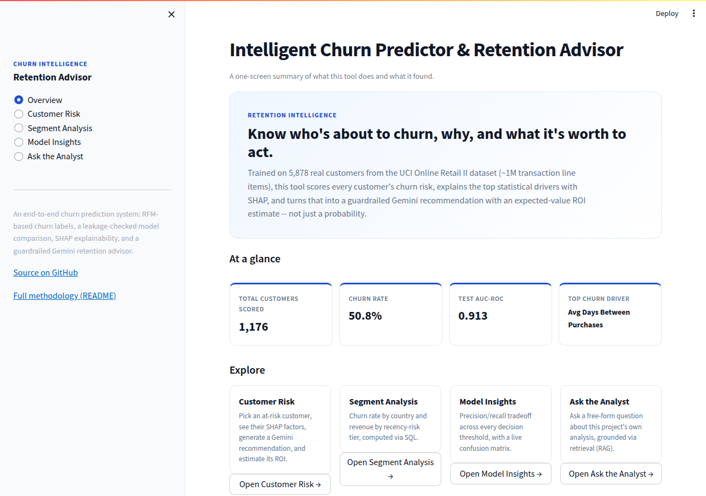
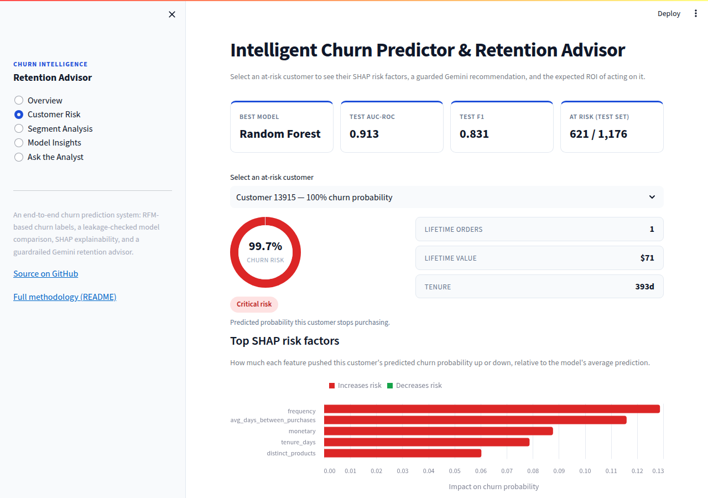
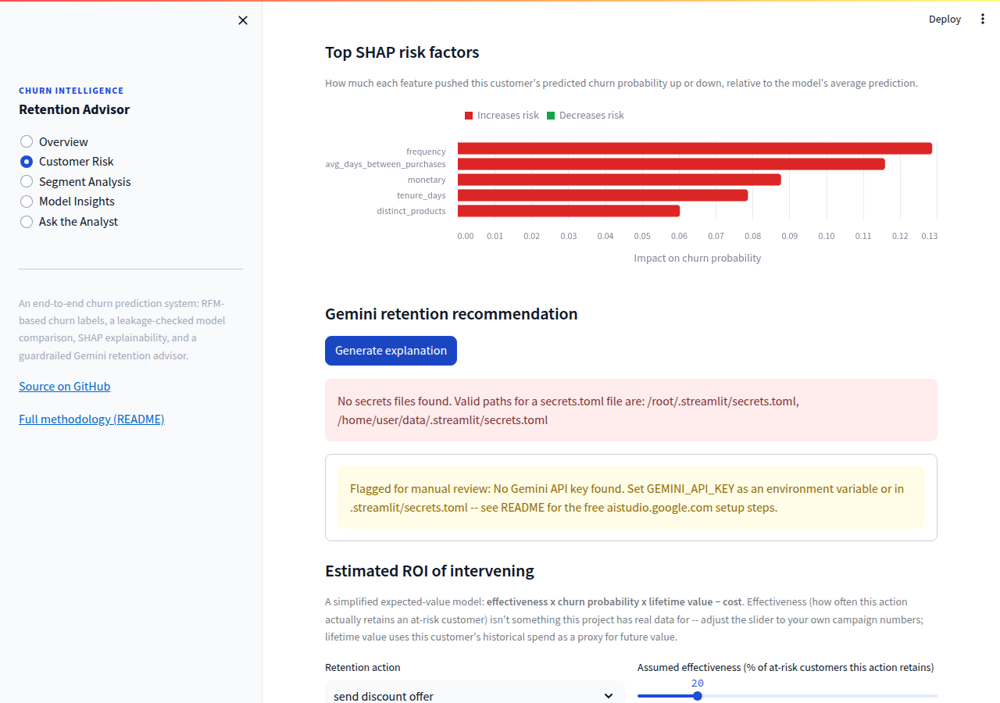
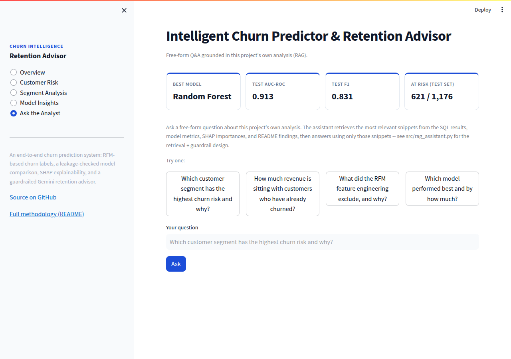
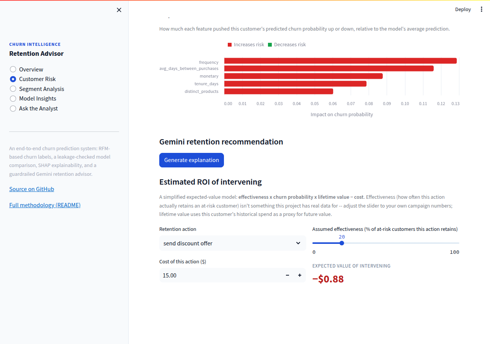
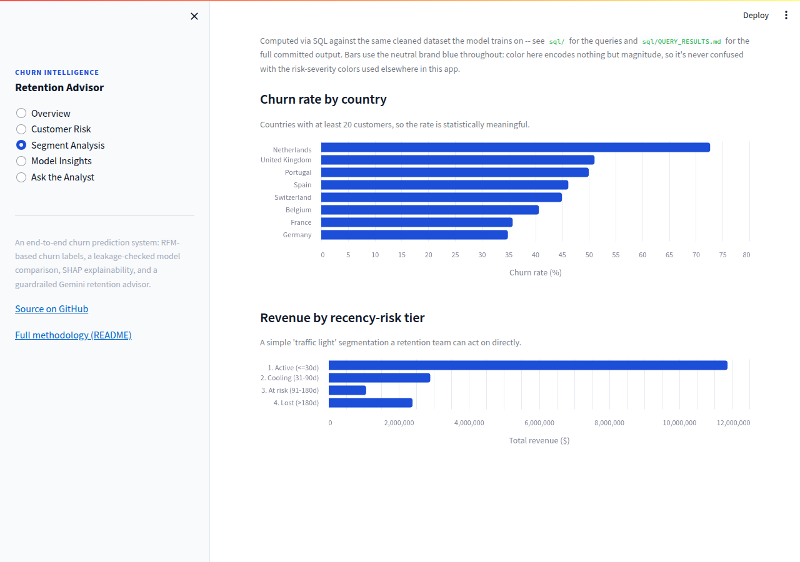
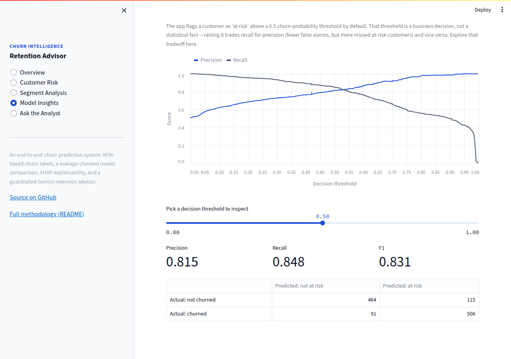
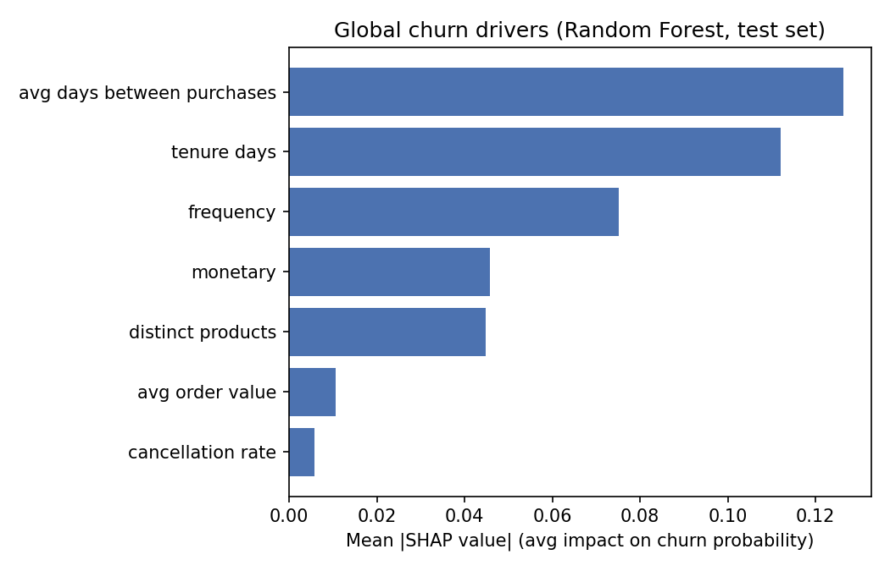

# Intelligent Churn Predictor & Retention Advisor

[](https://github.com/Daton-Star/churn-predictor-retention-advisor/actions/workflows/tests.yml)
[](LICENSE)

**🔴 [Live demo](https://churn-predictor-retention-advisor-w2rdhndvxpuzwkpqnc7rkw.streamlit.app/)** — deployed free on Streamlit Community Cloud.

An end-to-end churn prediction system for an online retailer: it predicts
*which* customers are about to churn, explains *why* using SHAP, and turns
that explanation into a plain-English, guardrailed retention recommendation
using Google's Gemini API — built entirely on free tools.

## Demo


*Recorded against a local run with no Gemini API key set, so it shows the guardrail path (the app flags for manual review instead of failing silently or inventing an answer) — see [Screenshots](#screenshots) below and the setup steps for what a live Gemini response looks like.*

## Screenshots

The app is a small sidebar-navigated dashboard, not a single script with tabs: a brand mark + page list on the left, a persistent KPI strip, and five pages.

| Overview | Customer Risk |
|---|---|
|  |  |
| The landing page: what this tool does, headline numbers, and one-click links into each other page. | Select any at-risk customer to see their churn probability as a gauge and their top SHAP risk factors. |

| Guardrail + ROI calculator | Ask the Analyst (RAG) |
|---|---|
|  |  |
| Shows the guardrail path (no API key configured) rather than a live Gemini call — add your own key (setup below) to see a real generated explanation and recommendation. | Ask a free-form question about the project's own analysis, or click one of the example chips; answers are grounded in retrieved context, same honesty note as above applies. |

| ROI calculator (detail) | Segment Analysis | Model Insights |
|---|---|---|
|  |  |  |
| Turns a SHAP-explained risk score into a dollar decision: expected value = effectiveness × churn probability × lifetime value − cost, with every assumption an editable input. | The SQL layer's country and recency-tier breakdowns ([`sql/`](sql/)), rendered live in the app instead of sitting in a separate folder. Color here is neutral brand blue throughout — magnitude only, never confused with risk severity. | The model's 0.5 default threshold is a business choice, not a statistical fact — this page makes the precision/recall tradeoff explorable instead of implicit. |

## 1. Business problem

Retention teams at subscription-free, repeat-purchase retailers (gift shops,
e-commerce, consumer goods) can't wait for a customer to formally "cancel" —
there's no cancellation event to watch for. By the time a customer is
obviously gone, it's too late to intervene. This project answers three
questions a retention team actually needs answered, in order:

1. **Who** is likely to go quiet in the near future?
2. **Why** — in terms a non-technical account rep can act on, not a
   coefficient table?
3. **What should we do about it** — one concrete, budget-appropriate action,
   not an open-ended AI ramble?

## 2. Approach

```
Raw transactions (UCI Online Retail II, ~1M rows)
        │  data_prep.py
        ▼
Cleaned transactions → RFM churn label + per-customer features
        │  train_model.py
        ▼
LogReg / Random Forest / XGBoost, 5-fold CV, SMOTE (train only) → best model
        │  explain.py
        ▼
SHAP TreeExplainer → top factors per customer
        │  genai_advisor.py
        ▼
Gemini → 2-sentence explanation + guardrailed action
        │  app.py
        ▼
Streamlit UI
```

### Data → churn label engineering

The dataset (UCI [Online Retail II](https://archive.ics.uci.edu/dataset/502/online+retail+ii),
~1.07M transaction line items, Dec 2009–Dec 2011, UK-based online gift
retailer) has **no churn label** — it's raw transactions. `data_prep.py`
builds one:

- **Missing CustomerID** (~23% of rows): dropped. These are unattributable
  point-of-sale-style rows; there is no customer to track churn *for*.
- **Cancelled orders** (invoice numbers starting with `C`): excluded from
  revenue/frequency totals (a cancellation isn't a purchase), but **not**
  discarded — cancellation behavior is kept as its own feature
  (`cancellation_rate`), on the theory that a customer who cancels often is
  a plausible flight risk in their own right.
- **Country formatting**: whitespace-trimmed, a handful of known duplicate
  spellings unified (`EIRE` → `Ireland`, etc.).
- **Churn label**: a customer is `churned = 1` if their most recent
  purchase is more than **90 days** before the dataset's last recorded
  transaction. This threshold isn't arbitrary — `data_prep.py` computes the
  actual distribution of gaps between a customer's repeat purchases
  (median 24 days, p75 61 days, p90 134 days) and 90 days sits comfortably
  above normal shopping cadence, so it flags genuinely unusual silence
  rather than penalizing customers who simply buy quarterly.

### Features engineered

| Feature | Description |
|---|---|
| `frequency` | Distinct non-cancelled invoices |
| `monetary` | Total spend (excludes cancellations & non-positive-price adjustment rows) |
| `avg_order_value` | `monetary / frequency` |
| `distinct_products` | Distinct real products purchased (excludes postage/fee/adjustment codes) |
| `tenure_days` | Days since first purchase |
| `avg_days_between_purchases` | Average gap between orders (dataset-median-filled for single-order customers) |
| `cancellation_rate` | Share of a customer's invoices that were cancellations |
| `recency_days` | *Computed but deliberately excluded from the model* — see below |

**Why `recency_days` is not a model feature:** the churn label is *defined*
as `recency_days > 90`. Feeding recency into the model would let it "solve"
the problem by memorizing the labeling rule instead of learning the
underlying behavioral pattern (falling frequency, narrowing product range,
etc.) that actually predicts churn. This was caught during development —
the first training run scored a suspicious 1.00 AUC across all three
models, which was the tell. `recency_days` is still computed and stored for
display purposes (e.g. "last purchased 45 days ago" in the app).

### Modeling

- Stratified 80/20 train/test split.
- **SMOTE on training folds only**, wired in via an `imbalanced-learn`
  `Pipeline` so it's refit inside each individual cross-validation fold —
  never on a validation fold or the held-out test set. Oversampling before
  splitting (a common mistake) lets synthetic points leak information
  across the split and inflates every metric.
- 5-fold stratified CV comparing Logistic Regression (baseline), Random
  Forest, and XGBoost on AUC-ROC, F1, precision, and recall.
- **Selection metric: AUC-ROC**, not accuracy — accuracy rewards predicting
  the majority class and says nothing about how well the model *ranks*
  customers by risk, which is what a retention team with a limited budget
  actually needs.
- Best model refit on the full training set, evaluated once on the
  untouched test set.
- Every CV run and the final model are logged to **MLflow** (params +
  metrics + the model artifact) under `mlruns/`.

### SQL analysis

The same churn/RFM logic in `src/data_prep.py` is reimplemented in SQL —
CTEs, window functions, `CASE`-based segmentation — against a SQLite copy
of the cleaned transactions, in [`sql/`](sql/). It answers four business
questions directly (top customers by spend, churn rate by country, revenue
at risk, recency-based risk tiers) and cross-validates the pandas pipeline:
both independently agree on 5,878 customers at a 50.8% churn rate. Real
output from running all four queries is committed at
[`sql/QUERY_RESULTS.md`](sql/QUERY_RESULTS.md) — no database client needed
to see the results. The country and recency-tier breakdowns are also
rendered live in the app's **Segment Analysis** page
([`src/segments.py`](src/segments.py) parses the committed markdown table
straight into the chart — no second query needed), so the SQL work shows up
as part of the product, not a folder next to it.

### Explainability

`shap.TreeExplainer` computes exact per-customer Shapley values for the
winning tree ensemble — fast, exact, and (unlike a global importance chart)
answers "why is *this* customer flagged" rather than "what does the model
care about on average."

### Threshold tuning

The app defaults to flagging a customer "at risk" above a 0.5 churn
probability — but that cutoff is a business decision (how many false alarms
is a limited retention budget worth?), not a statistical fact. The
**Model Insights** page plots precision and recall against every possible
threshold (`sklearn.metrics.precision_recall_curve` on the held-out test
set) and lets you pick one interactively, recomputing the confusion matrix
and precision/recall/F1 on the fly.

### Design system

The UI is a real design system, not per-element styling: `src/app.py` defines
an 8px spacing scale and a small type scale as CSS custom properties
(`--space-1`…`--space-8`, `--text-xs`…`--text-3xl`), plus a restrained
palette — deep blue (`#1D4ED8`) and slate neutrals for everything, with
red/amber/green held back strictly for risk severity and ROI sign (positive
vs. negative expected value). Every chart that *isn't* encoding risk — the
segment breakdowns, the precision/recall curve — uses the neutral blue
rather than borrowing a "risk" color for an unrelated series, so color never
has to be mentally filtered to find the signal that matters. Navigation is a
sidebar page list (Overview / Customer Risk / Segment Analysis / Model
Insights / Ask the Analyst) with a brand mark at the top, closer to a
Stripe/Linear-style product shell than a single script with tabs — including
a landing **Overview** page whose four cards deep-link into the other pages
via `st.session_state`.

### GenAI layer

For a given customer's top SHAP factors, Gemini (`gemini-2.5-flash`, free
tier via [Google AI Studio](https://aistudio.google.com/app/apikey))
generates a 2-sentence plain-English explanation and picks **exactly one**
action from a fixed list:

> `send discount offer` · `proactive support call` · `loyalty upgrade` ·
> `re-engagement email` · `no action needed`

The model is instructed to pick from this list, and — because instructions
alone don't bind an LLM — **the response is validated in code afterward**;
anything that doesn't match exactly is flagged `needs_manual_review` and
shown to the user as such rather than silently passed through. Temperature
is set to 0.25: this tool informs a real retention action, so consistency
matters more than creative variety.

### RAG Q&A assistant

A second, separate GenAI feature ([`src/rag_assistant.py`](src/rag_assistant.py)):
free-form questions like *"which customer segment has the highest churn
risk and why?"* against the project's own generated analysis — the SQL
query results, model evaluation metrics, SHAP feature importances, and the
README's own findings — rather than requiring someone to go read four
different files.

- **Corpus**: ~12 short chunks assembled from `sql/QUERY_RESULTS.md`,
  `reports/model_comparison.json`, `reports/feature_importance.json`, and
  three analytical sections of this README (business problem, key
  findings, limitations) — deliberately excludes setup/deployment
  instructions, which aren't answers to analytical questions.
- **Retrieval**: each chunk is embedded once with Gemini's free-tier
  `gemini-embedding-001` model and cached to disk; a question is embedded
  the same way and matched by brute-force cosine similarity (no vector
  DB — a dozen vectors is microseconds in numpy, and a vector
  database would be infrastructure with no payoff at this scale).
- **Guardrail**: if the best-matching chunk's similarity score is below a
  threshold, the assistant answers "I don't have enough information in
  this project's analysis" *without ever calling the generation model* —
  same philosophy as the action guardrail above: an ungrounded but
  fluent-sounding answer is worse than no answer.

Try it in the app's **"Ask the Analyst"** page, or from the CLI:
`python src/rag_assistant.py` (builds the index, then runs one example
question end-to-end).

## 3. Model comparison

5-fold stratified cross-validation on the training set (4,702 customers):

| Model | AUC-ROC | F1 | Precision | Recall |
|---|---|---|---|---|
| Logistic Regression (baseline) | 0.870 | 0.804 | 0.785 | 0.822 |
| **Random Forest** | **0.913** | **0.824** | **0.821** | **0.827** |
| XGBoost | 0.910 | 0.816 | 0.818 | 0.815 |

**Random Forest** was selected (highest mean CV AUC-ROC) and evaluated once
on the held-out test set (1,176 customers, never used in CV or training):

| Metric | Test set score |
|---|---|
| AUC-ROC | 0.913 |
| F1 | 0.831 |
| Precision | 0.815 |
| Recall | 0.848 |
| Accuracy | 0.825 |

Confusion matrix (test set):

| | Predicted: stays | Predicted: churns |
|---|---|---|
| **Actual: stays** | 464 (TN) | 115 (FP) |
| **Actual: churns** | 91 (FN) | 506 (TP) |

*(All numbers above are from an actual run of this pipeline against the
real dataset — reproducible via the fixed random seed in `src/config.py`.
Re-run `python src/train_model.py` to regenerate `reports/model_comparison.json`.)*

## 4. Key findings — top churn drivers

Ranked by mean absolute SHAP value across the test set:



1. **`avg_days_between_purchases`** — by far the strongest signal. Customers
   whose historical shopping cadence is already slow are the likeliest to
   go quiet, independent of how much they've spent in total.
2. **`tenure_days`** — counterintuitively, *longer*-tenured customers skew
   towards higher predicted risk in this dataset. Read together with the
   next point, this looks like a "graduated wholesaler" effect: a
   meaningful share of long-tenured accounts in this dataset behave like
   B2B buyers who front-loaded large orders early in the relationship and
   then went quiet, rather than steady repeat retail shoppers.
3. **`frequency`** — low order counts are a real risk signal, as expected.
4. **`monetary`** and **`distinct_products`** — moderate signal; big
   spenders and broad-basket shoppers skew safer, but with more
   customer-to-customer variance than the top two features.
5. **`avg_order_value`** and **`cancellation_rate`** — weak signal in this
   dataset. Cancellation rate in particular was expected to matter more; in
   practice, this dataset's mass-cancellations come disproportionately from
   a small number of high-volume wholesale accounts rather than being a
   broad-based dissatisfaction signal.

## 5. Business impact framing

A statistical score ("84.8% recall") doesn't tell a business user whether
acting on it is worth the money. The app's **Estimated ROI of intervening**
section (bottom of the Customer Risk page) turns each customer's
churn probability into a dollar decision with a simplified expected-value
model:

```
expected value = effectiveness × churn probability × lifetime value − cost
```

- **Lifetime value** uses the customer's historical spend (`monetary`) as a
  proxy for the revenue preserved if they're retained.
- **Effectiveness** — how often a given action (discount, support call,
  loyalty upgrade, ...) actually retains an at-risk customer — is not
  something this project has real campaign data for, so it's an editable
  slider (default 20%), not a hardcoded number. That's deliberate: a real
  analyst would plug in their own historical win-back rate here, and the
  point of the tool is to make that assumption explicit and adjustable
  rather than buried in a spreadsheet formula.
- **Cost** defaults to an illustrative per-action placeholder
  (`DEFAULT_ACTION_COST` in `src/app.py`) and is also editable.

This surfaces real, useful signal even with placeholder inputs: e.g. a
long-shot customer with low lifetime value can have a *negative* expected
value for an otherwise-recommended action — a concrete "don't bother"
signal a pure classification score never gives you.

Scaled to the whole test set as a sanity check: at the default 20%
effectiveness and a $15 action cost, the 506 correctly-flagged churners
(true positives) versus 115 false alarms in the confusion matrix above
imply `(506 × 0.20 × avg. monetary) − (621 × $15)` — plug in real
numbers for your business via the app rather than trusting a single
worked example here.

## 6. Limitations and what I'd do with more time

- **Right-censored label.** A customer who bought yesterday is labeled
  "not churned" only because the dataset ends before we can observe them
  go quiet — some fraction of today's "retained" customers are actually
  about to churn just outside the observation window. A proper survival-
  analysis framing (time-to-churn, censoring-aware) would handle this more
  rigorously than a binary snapshot label.
- **Single train/test split.** One 80/20 split, not a repeated or
  time-based backtest. With more time I'd validate with a rolling-origin
  time split (train on 2009–2010 behavior, predict 2011 churn) to check the
  model generalizes forward in time, not just to a random held-out sample
  from the same period.
- **No hyperparameter search.** Model hyperparameters are reasonable
  defaults, not tuned (e.g. via `GridSearchCV`/`Optuna`). Given the healthy
  AUC gap between models, tuning would likely yield a smaller improvement
  than the modeling choices already made (SMOTE placement, dropping
  `recency_days`), but it's the obvious next lever.
- **SHAP + Gemini cost, not correctness, was optimized.** `TreeExplainer`
  is exact for tree models, but the natural-language explanation layer on
  top of it is not verified beyond the action-guardrail — a factually wrong
  but fluent-sounding *explanation* (as opposed to an invalid *action*)
  would currently reach the user. A stricter version would also constrain
  or template the explanation text itself.
- **Single retailer, single country dominant, 2009–2011.** The UK-heavy,
  gift-retail-specific dataset limits how far these exact feature
  importances generalize to a different business; the pipeline (label
  engineering → RFM features → SMOTE-in-CV → SHAP → guardrailed LLM
  action) is the reusable part, not the specific coefficients.
- **No monitoring/drift detection.** A production version would need
  scheduled retraining and drift checks (e.g. population stability index on
  the input features) since customer behavior — and what counts as a normal
  90-day gap — will drift over time.

## 7. Tech stack

| Layer | Tool |
|---|---|
| Data wrangling | pandas, openpyxl |
| SQL analysis | SQLite (CTEs, window functions) |
| Imbalance handling | imbalanced-learn (SMOTE) |
| Modeling | scikit-learn (Logistic Regression, Random Forest), XGBoost |
| Experiment tracking | MLflow |
| Explainability | SHAP (TreeExplainer) |
| GenAI | Google Gemini API (`google-genai`, free tier) — generation + `gemini-embedding-001` for the RAG assistant |
| App | Streamlit, Altair (charts) |
| Testing / CI | pytest, GitHub Actions |
| Everything else | Python 3.11 |

Every tool above is free (open source, or a free API tier with no credit
card required).

## 8. Setup and run instructions

### Prerequisites

- Python 3.11+
- A free Gemini API key from [aistudio.google.com/app/apikey](https://aistudio.google.com/app/apikey)
  (sign in with a Google account → "Create API key" → no billing setup
  needed for the free tier)

### Install

```bash
python -m venv .venv
source .venv/bin/activate          # Windows: .venv\Scripts\activate
pip install -r requirements.txt
```

### Get the data

Download the dataset from the [UCI Online Retail II page](https://archive.ics.uci.edu/dataset/502/online+retail+ii)
and save the Excel file as `data_raw/online_retail_II.xlsx` (create the
`data_raw/` folder if it doesn't exist). The file is ~45MB and is not
included in this repo.

### Run the pipeline

```bash
cd src
python data_prep.py      # -> data_processed/customer_features.csv
python train_model.py    # -> models/churn_model.joblib, reports/model_comparison.json, mlruns/
python explain.py        # -> models/shap_values.joblib
```

Inspect experiment runs with `mlflow ui --backend-store-uri file:../mlruns`
from the `src/` directory.

### Configure your Gemini key locally

```bash
cp .streamlit/secrets.toml.example .streamlit/secrets.toml
# edit .streamlit/secrets.toml and paste your real key
```

Or, without Streamlit's secrets file, just export an environment variable:

```bash
export GEMINI_API_KEY="your-key-here"
```

### Run the app

```bash
streamlit run src/app.py
```

### Explore the SQL analysis (optional)

```bash
python sql/build_db.py     # -> sql/online_retail.db
python sql/run_queries.py  # -> sql/QUERY_RESULTS.md
```

### Build the RAG index (optional)

Not required before running the app — it builds the index itself on first
use of the "Ask the Analyst" page (and caches it for the rest of that
process). Running it up front just avoids that first-question delay and
lets you try it from the CLI:

```bash
python src/rag_assistant.py   # -> models/rag_index.joblib + one example Q&A
```

## Testing & CI

```bash
pip install -r requirements-dev.txt
python -m pytest tests/ -v
```

31 tests cover the churn-label/RFM logic (`tests/test_data_prep.py`), the
SHAP factor-ranking logic (`tests/test_explain.py`), the Gemini action
guardrail (`tests/test_genai_advisor.py`), and the RAG assistant's chunking,
cosine-similarity ranking, and grounding guardrail
(`tests/test_rag_assistant.py`) — valid actions, invalid actions, missing
keys, low-similarity refusals, and API failures all resolving to a safe,
non-crashing result. All four suites run against small hand-built synthetic
data (or the real, small, already-committed `sql/`/`reports/` artifacts —
never the 45MB raw dataset), so they run in a couple of seconds and never
call a real LLM — including in CI, which runs them via GitHub Actions
([`.github/workflows/tests.yml`](.github/workflows/tests.yml)) on every push
and pull request.

## Deployment (Streamlit Community Cloud, free)

**Already live:** [churn-predictor-retention-advisor-w2rdhndvxpuzwkpqnc7rkw.streamlit.app](https://churn-predictor-retention-advisor-w2rdhndvxpuzwkpqnc7rkw.streamlit.app/)

To deploy your own copy:

1. Push this repo to GitHub (raw data and secrets stay out — see
   `.gitignore`; the trained model + precomputed test-set artifacts under
   `models/` **are** committed on purpose so the app has something to serve
   without re-running the pipeline against the excluded raw dataset).
2. Go to [share.streamlit.io](https://share.streamlit.io), connect your
   GitHub account, and deploy this repo with **`src/app.py`** as the main
   file path. `runtime.txt` pins the Python version (3.11) so Streamlit
   Cloud doesn't default to one the pinned dependency versions weren't
   tested against.
3. In the app's **Settings → Secrets**, add:
   ```toml
   GEMINI_API_KEY = "your-key-here"
   ```
4. Deploy. No code changes needed — `genai_advisor.py` checks `st.secrets`
   first and falls back to an environment variable, so the same code runs
   locally and on Streamlit Cloud.

## Project structure

```
├── data_raw/              # not committed — download instructions above
├── data_processed/        # not committed — regenerated by data_prep.py
├── models/                # committed: trained model + test-set artifacts the app serves
├── mlruns/                 # not committed — regenerated by train_model.py
├── reports/                # committed: metrics + charts referenced in this README
├── screenshots/            # committed: app screenshots referenced in this README
├── sql/                    # SQL reimplementation of the churn/RFM logic + real query output
│   ├── build_db.py
│   ├── run_queries.py
│   ├── 01-04_*.sql
│   └── QUERY_RESULTS.md
├── tests/                  # pytest suite (synthetic data, no raw dataset needed)
├── .github/workflows/
│   └── tests.yml           # CI: runs the test suite on every push/PR
├── src/
│   ├── config.py           # paths, business-rule constants, feature list
│   ├── data_prep.py        # Stage 1: raw transactions -> churn-labeled customer features
│   ├── train_model.py      # Stage 2: model comparison, selection, MLflow logging
│   ├── explain.py          # Stage 3: SHAP per-customer explanations
│   ├── genai_advisor.py    # Stage 4: Gemini explanation + guardrailed action
│   ├── rag_assistant.py    # RAG Q&A over the project's own analysis
│   ├── segments.py         # parses sql/QUERY_RESULTS.md for the Segment Analysis page
│   └── app.py               # Streamlit dashboard: sidebar nav, 5 pages (Overview, Customer
│                             #   Risk, Segment Analysis, Model Insights, Ask the Analyst)
├── .streamlit/
│   ├── config.toml          # app theme (colors, font)
│   └── secrets.toml.example
├── requirements.txt
├── requirements-dev.txt
├── runtime.txt              # pins Python 3.11 for Streamlit Community Cloud
├── LICENSE                  # MIT
└── README.md
```

## License

MIT — see [LICENSE](LICENSE). The dataset ([UCI Online Retail
II](https://archive.ics.uci.edu/dataset/502/online+retail+ii)) is not
redistributed in this repo and is used here for research/educational
purposes only.
